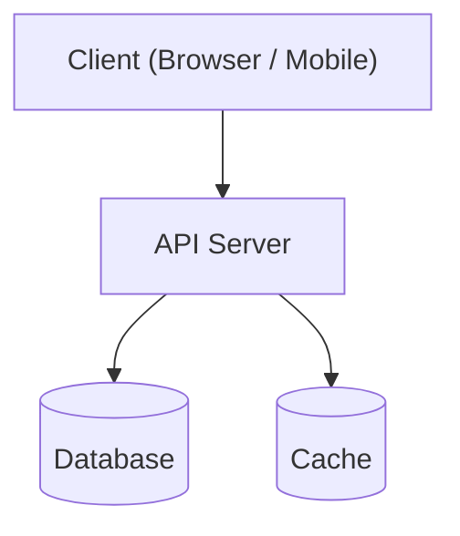
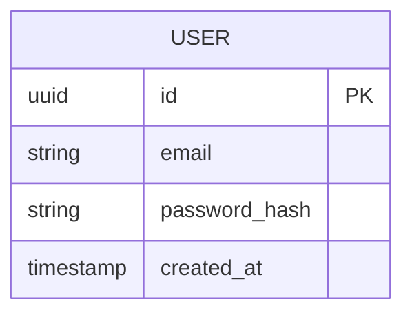

# Architecture Document

**Project**: [Project Name]
**Version**: 1.0
**Date**: YYYY-MM-DD
**Author**: Architect
**Status**: Draft | In Review | Approved

---

## 1. Overview

[1-2 paragraphs describing the system at a high level]

---

## 2. Architecture Diagram



---

## 3. Technology Stack

| Layer | Technology | Rationale |
|---|---|---|
| Frontend | [e.g., Next.js 14] | [Why] |
| Backend | [e.g., Node.js + Fastify] | [Why] |
| Database | [e.g., PostgreSQL 16] | [Why] |
| Cache | [e.g., Redis 7] | [Why] |
| Hosting | [e.g., AWS ECS] | [Why] |
| CI/CD | [e.g., GitHub Actions] | [Why] |
| Monitoring | [e.g., Grafana + Prometheus] | [Why] |

---

## 4. System Components

### 4.1 Frontend
- **Type**: [SPA / SSR / Static]
- **Framework**: 
- **Key libraries**: 
- **Build tool**: 
- **Deployment**: 

### 4.2 API Server
- **Language**: 
- **Framework**: 
- **Port**: 
- **Authentication**: 
- **API style**: [REST / GraphQL / gRPC]

### 4.3 Database
- **Engine**: 
- **Schema overview**: [link to migration files or describe]
- **Connection pooling**: 
- **Backup strategy**: 

### 4.4 Cache
- **Engine**: 
- **Use cases**: [session, query cache, rate limiting, etc.]

---

## 5. API Design

### Base URL
```
https://api.[domain]/v1
```

### Authentication
```
Authorization: Bearer <JWT>
```

### Key Endpoints (overview)

| Method | Path | Description |
|---|---|---|
| POST | `/auth/register` | User registration |
| POST | `/auth/login` | User login |
| GET | `/health` | Health check |

---

## 6. Data Model (High Level)



---

## 7. Infrastructure & Deployment

### Environments

| Env | URL | Purpose |
|---|---|---|
| dev | localhost | Local development |
| staging | staging.[domain] | Pre-production testing |
| production | [domain] | Live |

### Docker Compose (dev)
```yaml
# See docker-compose.yml
```

### CI/CD Pipeline
```
Push to branch → CI (lint, test) → PR → Merge to main → Deploy to staging → Manual promote → Production
```

---

## 8. Security

- **Auth**: [JWT / OAuth 2.0 / OIDC]
- **HTTPS**: Enforced everywhere; HTTP redirects to HTTPS
- **CORS**: Allowlist only
- **Rate limiting**: [e.g., 100 req/min per IP]
- **Input validation**: [library/approach]
- **Secrets**: Environment variables via [Vault / AWS Secrets Manager / .env]
- **Dependencies**: Automated vulnerability scanning via [Dependabot / Snyk]

---

## 9. Non-Functional Targets

| Attribute | Target | Approach |
|---|---|---|
| API p95 latency | < 200ms | Cache + DB indexes |
| Availability | 99.9% | Multi-AZ, health checks |
| Scalability | [N] req/sec | Horizontal scaling |

---

## 10. Architecture Decision Records

| ADR | Title | Status |
|---|---|---|
| ADR-001 | [Decision] | Accepted |

Full ADRs in `docs/adr/`.

---

## Revision History

| Version | Date | Author | Changes |
|---|---|---|---|
| 1.0 | YYYY-MM-DD | Architect | Initial draft |
