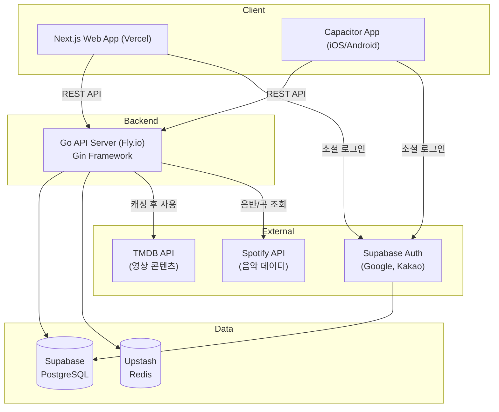
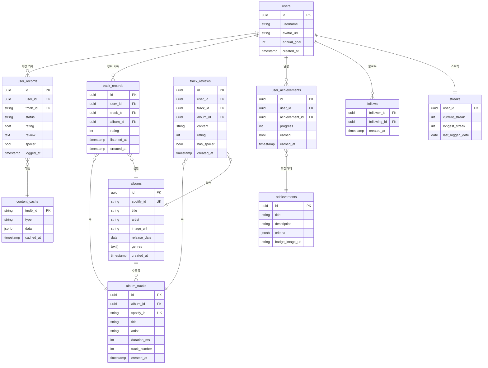

# Architecture Document

**Project**: 콘텐츠 기록 & 게임화 플랫폼
**Version**: 0.1
**Date**: 2026-04-27
**Author**: Architect
**Status**: Approved

---

## 1. Overview

영화·시리즈·예능·음악 콘텐츠 기록 및 게임화 플랫폼. 모바일 퍼스트 웹앱으로 시작해 Capacitor를 통해 iOS/Android 앱으로 확장한다. Go 백엔드 API + Next.js 프론트엔드로 구성된 명확한 클라이언트-서버 분리 구조를 채택한다.

**EP04 추가**: 음악 음반 평가 시스템 (곡 단위 평가 → 음반 자동 평점)

---

## 2. 시스템 아키텍처 다이어그램



---

## 3. 기술 스택

| Layer | 기술 | 버전 | 선택 이유 |
|---|---|---|---|
| Frontend | Next.js | 14 (App Router) | SSR/SSG, SEO, PWA 지원 |
| Frontend 언어 | TypeScript | 5.x | 타입 안전성 |
| Styling | Tailwind CSS | 3.x | 모바일 퍼스트 유틸리티 |
| Mobile 래핑 | Capacitor | 6.x | 웹앱 → iOS/Android, 코드 변경 최소 |
| Backend | Go | 1.22 | 낮은 메모리, 저렴한 인프라 |
| Backend 프레임워크 | Gin | 1.x | 가볍고 빠름, 생태계 성숙 |
| ORM | sqlc + pgx | - | SQL 직접 작성, 타입 안전 Go 코드 생성 |
| Database | Supabase (PostgreSQL) | 16 | Auth 내장, 무료 티어, 관리형 |
| Cache | Upstash Redis | - | 서버리스, 무료 티어, TMDB/Spotify 응답 캐싱 |
| Auth | Supabase Auth | - | Google/Kakao OAuth 내장 |
| 영상 콘텐츠 DB | TMDB API | v3 | 글로벌 영화·시리즈·예능 데이터, 무료 |
| 음악 콘텐츠 DB | Spotify Web API | - | 글로벌 음악 데이터, Free tier (Client Credentials) |
| Frontend 호스팅 | Vercel | - | Next.js 최적화, 무료 티어 |
| Backend 호스팅 | Fly.io | - | Go 바이너리, ~$3-5/월 |
| CI/CD | GitHub Actions | - | 무료 티어 |

---

## 4. 컴포넌트 상세

### 4.1 Frontend (Next.js)

- **렌더링 전략**
  - 작품 상세 페이지: SSG + ISR (SEO 중요, TMDB 데이터 기반)
  - 피드, 프로필, 게임화 페이지: CSR (로그인 필요, 개인화)
  - 검색: CSR (실시간)
- **모바일 퍼스트**: Tailwind CSS 기본 스타일을 모바일 기준으로 작성
- **PWA**: `next-pwa` 플러그인으로 서비스 워커, 오프라인 기본 지원
- **Capacitor 연동**: Next.js 빌드 결과물(`out/`)을 Capacitor가 래핑

### 4.2 Backend (Go + Gin)

- **포트**: 8080
- **구조**: 레이어드 아키텍처
  ```
  cmd/server/         → 진입점
  internal/
    handler/          → HTTP 핸들러 (Gin)
    service/          → 비즈니스 로직
    repository/       → DB 접근 (sqlc 생성 코드)
    middleware/        → Auth, CORS, Rate limit
  pkg/
    tmdb/             → TMDB API 클라이언트
    cache/            → Redis 클라이언트
  ```
- **인증**: Supabase JWT 검증 (미들웨어)
- **TMDB 캐싱**: Redis에 24시간 TTL로 응답 캐싱

### 4.3 Database (Supabase PostgreSQL)

핵심 테이블:



### 4.4 Cache 전략 (Upstash Redis)

| 키 패턴 | 내용 | TTL |
|---|---|---|
| `tmdb:movie:{id}` | TMDB 영화 상세 | 24h |
| `tmdb:search:{query}` | 검색 결과 | 1h |
| `spotify:album:{id}` | Spotify 음반 상세 + 곡목 | 24h |
| `spotify:search:{query}` | Spotify 음반 검색 결과 | 1h |
| `user:feed:{userId}` | 친구 피드 | 5m |
| `achievement:progress:{userId}` | 도전과제 진척도 | 10m |

---

## 5. API 설계

### Base URL
```
https://api.[domain]/v1
```

### 인증
```
Authorization: Bearer <Supabase JWT>
```

### 주요 엔드포인트

| Method | Path | 설명 |
|---|---|---|
| GET | `/content/search` | 작품 검색 (TMDB 프록시) |
| GET | `/content/:tmdbId` | 작품 상세 |
| GET | `/content/:tmdbId/reviews` | 작품 리뷰 목록 |
| POST | `/records` | 시청 기록 추가/수정 |
| GET | `/users/:userId/records` | 유저 시청 기록 |
| GET | `/users/:userId/stats` | 유저 통계 (히트맵 등) |
| GET | `/users/:userId/profile` | 프로필 |
| GET | `/achievements` | 도전과제 목록 |
| GET | `/achievements/me` | 내 도전과제 진척도 |
| GET | `/social/feed` | 친구 피드 |
| POST | `/social/follow/:userId` | 팔로우 |
| GET | `/social/compatibility/:userId` | 취향 궁합 |
| GET | `/streaks/me` | 내 스트릭 |
| GET | `/goals/me` | 연간 목표 |
| PUT | `/goals/me` | 연간 목표 설정 |
| **음악 기능** | | |
| GET | `/music/search` | 음반 검색 (Spotify 프록시) |
| GET | `/music/albums/:spotifyId` | 음반 상세 + 곡목 |
| POST | `/music/tracks/rate` | 곡 평가 저장 |
| GET | `/users/:userId/music-records` | 청취 기록 |
| GET | `/users/:userId/music-stats` | 음악 통계 (히트맵 등) |
| POST | `/music/tracks/:trackId/reviews` | 곡 리뷰 작성 |
| GET | `/music/genres/ratings` | 선호 장르 분석 |

---

## 6. 인증 흐름

```
Client → Supabase Auth (Google/Kakao OAuth)
       ← JWT 발급
Client → Go API (Authorization: Bearer JWT)
Go API → Supabase JWT 공개키로 검증
       → user_id 추출 → 요청 처리
```

별도 인증 서버 불필요. Supabase Auth가 OAuth + JWT 발급 전담.

---

## 7. 모바일 배포 전략 (Capacitor)

```
1. Next.js 빌드 → next export → out/ 폴더 생성
2. Capacitor가 out/ 폴더를 네이티브 WebView로 래핑
3. npx cap add ios / npx cap add android
4. 앱스토어 제출
```

API 통신은 웹과 동일 (REST). 네이티브 기능 필요 시 Capacitor 플러그인:
- 푸시 알림: `@capacitor/push-notifications`
- 햅틱 피드백: `@capacitor/haptics` (뱃지 획득 시)

---

## 8. 인프라 & 배포

### 환경 구성

| 환경 | Frontend | Backend | 비고 |
|---|---|---|---|
| dev | localhost:3000 | localhost:8080 | Docker Compose |
| production | Vercel | Fly.io | 자동 배포 |

### Docker Compose (로컬 개발)
```yaml
# docker-compose.yml
services:
  api:
    build: ./backend
    ports: ["8080:8080"]
    env_file: .env
  redis:
    image: redis:7-alpine
    ports: ["6379:6379"]
```
> Supabase는 로컬에서도 `supabase start`로 실행 가능 (Supabase CLI)

### CI/CD (GitHub Actions)
```
Push to main
  → Frontend: Vercel 자동 배포 (Vercel GitHub 연동)
  → Backend:  Go 빌드 + 테스트 → Fly.io 배포 (flyctl deploy)
```

---

## 9. 보안

- **HTTPS**: Vercel/Fly.io 기본 제공
- **CORS**: Go 미들웨어에서 Vercel 도메인만 허용
- **JWT 검증**: 모든 인증 필요 엔드포인트에 미들웨어 적용
- **Rate Limiting**: Gin 미들웨어 (IP 기반, 60 req/min)
- **환경변수**: Fly.io secrets / Vercel env vars (코드에 절대 하드코딩 금지)
- **TMDB API Key**: 백엔드에서만 사용 (클라이언트 노출 금지)

---

## 10. 비용 예측 (월)

| 서비스 | 티어 | 비용 |
|---|---|---|
| Vercel | Hobby (무료) | $0 |
| Fly.io | shared-cpu-1x, 256MB | ~$3 |
| Supabase | Free (500MB, 50K MAU) | $0 |
| Upstash Redis | Free (10K cmd/일) | $0 |
| TMDB API | 무료 | $0 |
| GitHub Actions | 무료 (2,000분/월) | $0 |
| **합계** | | **~$3/월** |

> MAU 50K, DB 500MB 초과 시 Supabase Pro ($25/월)로 업그레이드

---

## 11. Architecture Decision Records

| ADR | 제목 | 상태 |
|---|---|---|
| ADR-001 | Go + Gin 백엔드 선택 | Accepted |
| ADR-002 | Next.js + Capacitor 프론트엔드/모바일 전략 | Accepted |
| ADR-003 | Supabase로 DB + Auth 통합 | Accepted |
| ADR-004 | TMDB API + Redis 캐싱 전략 | Accepted |
| ADR-005 | Spotify Web API (Free tier) + 곡 단위 평가 → 음반 자동 평점 | Proposed |

전체 ADR: `docs/adr/`

---

## Revision History

| Version | Date | Author | Changes |
|---|---|---|---|
| 0.1 | 2026-04-27 | Architect | 초안 작성 |
| 0.2 | 2026-05-12 | Architect | EP04 음악 기능 추가 (Spotify API, 곡/음반 평가 시스템) |
